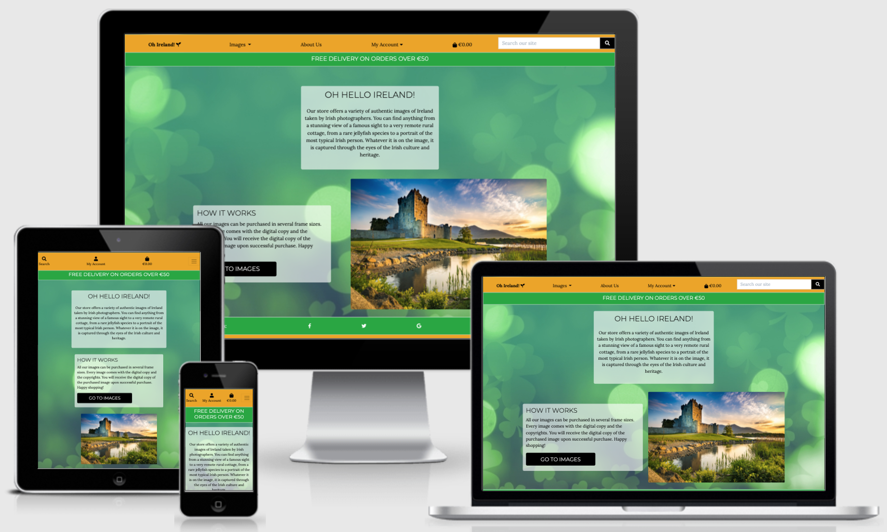
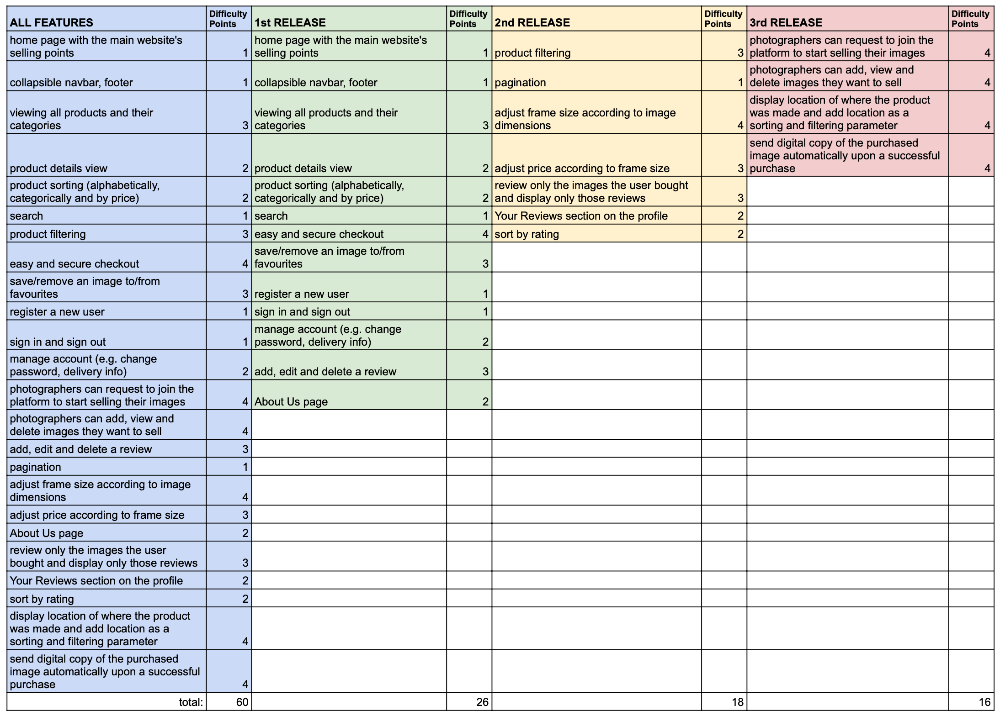
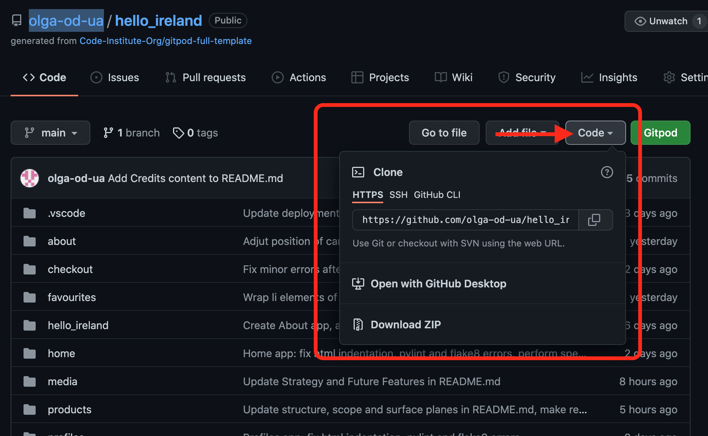

# Oh Hello Ireland

"Oh, Hello Ireland!" is an online store that sells unique images of Ireland. When buying an image the customer receives the copyrights for that particular image. Currently, images are broken down into 5 main categories: Buildings, Landscapes, Portraits, Ocean & Sealife and Wildlife.

Unlike other image stock online stores, "Oh, Hello Ireland!" sells images made by the greatest Irish photographers, meaning that all the objects in the images are presented through the eyes of true Irish people, reflecting their authenticity, nature and culture.

## The live website can be viewed here: [Oh Hello Ireland](https://hello-ireland.herokuapp.com/)



!NB: it is recommended to view the README.md and TESTING.md files in the GitHub Dark Theme turned on for distinct demarcation of the files' sections and screenshots. The Dark Theme can be turned on by going into your GitHub settings from the dropdown in the top right and then navigating to Appearance in the Account Settings from the menu on the left. Go to Theme Mode and select Single Theme (instead of the Sync with system) and then select a Dark Theme; refresh the page.

# CONTENT QUICK LINKS
## [STRATEGY PLANE](#the-strategy-plane)
## [USER STORIES](#user-stories-list)
## [THE SCOPE PLANE](#the-scope-plane-table)
## [THE STRUCTURE PLANE](#the-structure-plane-definition)
## [THE SKELETON PLANE](#the-skeleton-plane-wireframes)
## [THE SURFACE PLANE](#the-surface-plane-details)
## [FEATURES](#present-and-future-features)
## [DATABASE](#database-schema)
## [TECHNOLOGIES](#technologies-used)
## [TESTING](#detailed-testing)
## [DEPLOYMENT](#deployment-steps-and-instructions)
## [CREDITS](#code-credits)
## [ACKNOWLEDGEMENTS](#my-acknowledgements)


# THE STRATEGY PLANE

## The primary goal. 
- "Oh, Hello Ireland!" website is designed to provide a platform for products made by Irish photographers where their products (in the majority of the cases the product is an image or photo) will be sold in both printed and digital formats.

- The printed images are sold in 5 different frame sizes (i.e. A1, A2, A3, A4 and A5).

- The users will be able to register, browse products, search for products, add their favourite products to their Favourites.

- The users will be able to view and leave reviews as well as delete their own reviews they had left before.

- The users will be able to see the most popular product categories in the button-like form on All Images page in order to navigate to the desired category faster.

- The users will be able to sort and search for the products. The users will have an option to easily and quickly checkout.

- The customer's estimated needs are to find and buy quickly and easily buy their chosen products.

# USER STORIES LIST

The target audience is people of all ages and nationalities who are interested in browing and/or purchasing authentic images of Ireland.

### Viewing and Navigation

1. As a Customer I want to be able to see the full list of all products in order to select single products to purchase.

2. As a Customer I want to be able to view individual product details so that I can see the image in a higher resolution by opening it in a new window, identify the price, product rating, description, available sizes.

3. As a Customer I want to be able to see the grand total of my order at any time so that I can decide whether to buy more products or remove some from the basket.

4. As a Site User I want to be able to find some information about the website.

### Registration and User Accounts

5. As a Site User I want to be able to easily register for an account so that I can have a personal account and to be able to view my profile.

6. As a Site User I want to be able to easily login and logout so that I can access my personal information.

7. As a Site User I want to be able to easily recover password so that I can get access to my account.

8. As a Site User I want to be able to receive an email confirmation after registering in order to verify that my account registration was successful.

9. As a Site User I want to be able to have a personalized user account so that I can view my personal order history, save my payment details.

### Sorting and Searching

10. As a Shopper I want to be able to sort the list of available products in order to identify the best-priced, alphabetically and categorically sorted products.

11. As a Shopper I want to be able to sort a specific category of products in order to identify the best-priced product in a selected category, sort products in that category by name.

12. As a Shopper I want to be able to search for a product by name, location or description	in order to find a specific product I'd like to purchase.

13. As a Shopper I want to be able to see what I've searched for in the search result and the number of my search results in order to quickly decide whether the product I need is available.

### Purchasing and Checkout

14. As a Shopper I want to be able to easily select the quantity of the products I want to purchase	so that I can add the correct product and its quantity to my shopping bag.

15. As a Shopper I want to be able to view items in my shopping bag	so that I can identify the total cost of my order and the items I have ordered.

16. As a Shopper I want to be able to adjust the quantity of a particular item in my shopping bag so that I can easily make changes to my order before checkout.

17. As a Shopper I want to be able to easily submit my payment details in order to checkout effectively.

18. As a Shopper I want to be assured that my personal and payment information is safe and secure so that I can confidently provide information that is needed to complete a purchase.

19. As a Shopper I want to be able to view an order confirmation after checkout	so that I can verify that the order is correct.

20. As a Shopper I want to be able to receive an email confirmation after checkout in order to have a copy of the order confirmation for my records.

### Admin and Store Management

21. As a Store Owner I want to be able to add a new product so that I can add new items to my shop.

22. As a Store Owner I want to be able to edit a product so that I can change product criteria such as price, description, image etc.

23. As a Store Owner I want to be able to delete a product so that I can remove items that are no longer on sale.

### Reviews and Ratings

24. As a Site User I want to be able to see reviews of products from other users in order to quickly decide whether this particular image is worth the purchase.

25. As a Site User I want to be able to leave a review or several reviews on a specific product in order to quickly and easily share my opinion and impression of the given product.

26. As a Site User I want to be able to delete my own review/reviews I have ever left on the website so that I can easily delete the information I personally shared about a specific product.

### Favourite Products

27. As a Shopper/Site User I want to be able to add images that I liked to my favourites in order to quickly and easily find them in the future (e.g. save an image for a later purchase or review).

28. As a Shopper/Site User I want to be able to view images that I marked as my favourites so that I can proceed to purchase them.

29. As a Shopper/Site User I want to be able to remove images that I no longer want to be marked as My Favourites so that I can easily manage My Favourites section of my account.


## **[BACK TO TOP](#content-quick-links)** *
<hr style="height:5px;border-width:0;color:gray;background-color: #eca50b">


# THE SCOPE PLANE TABLE

The website is planned to have three main releases as identified in the table below in order to unfold new experiences for the users in the future.



This table shows all the website's existing features in the 1st Release column and Features that are still to be implemented in the 2nd and 3rd Release columns.

## **[BACK TO TOP](#content-quick-links)** *
<hr style="height:5px;border-width:0;color:gray;background-color: #eca50b">


# THE STRUCTURE PLANE DEFINITION

1. The website has the Navbar that will feature linear menu elements representing the self-explanatory main sections of the project, namely:

### Large Screens
* "Oh Ireland!" logo that is linked to the Home Page 
* Images dropdown with the following dropdown list items:
   - All Images
   - Buldnigs
   - Landscapes
   - Portraits
   - Ocean and Sea Life
   - Wildlife
* About Us
* My Account dropdown with the following dropdown list items:
   - Product Management (for site owners only)
   - My Profile (for authenticated users)
   - My Favourites (for authenticated users)
   - Logout (for authenticated users)
   - Register (for non-authenticated users)
   - Login (for non-authenticated users)
* Shopping Basket (represented by a shopping basket icon and displaying the grand total whenever there are items in the basket)
* Search bar

### Medium and Small Screen Sizes
* Search Bar
* My Account dropdown with the following dropdown list items:
   - Product Management (for site owners only)
   - My Profile (for authenticated users)
   - My Favourites (for authenticated users)
   - Logout (for authenticated users)
   - Register (for non-authenticated users)
* Shopping Basket (represented by a shopping basket icon and displaying the grand total whenever there are items in the basket)
* The collapsible menu that is the exact copy of the one for large screens except the items will be positioned in an unordered list.

2. The footer will appear on each page and view and will have the following information to hand:

* Social networks links
* Copyright with the link to the Home Page.

3. Home page the information about the website's main objective and about how the website works along with the link to the All Images page.

4. Images menu item will offer the user to select among All images and one of the five categories.

5. About Us page will give the user the brief information about the website creators. Here users will also be able to see the highest rated reviews and information about the website's photographers.

6. From My Account users will be able to manage their account, login and logout, manage their Favourite Products. The site owners will be able to manage Products.

7. The shopping basket icon will bring any user to their shopping bag where they will be able to see the details of the added products they are about to buy. It also gives the users the options to adjust the quantity of the products of a particular size, delete them from the basket and proceed to the secure checkout.


## **[BACK TO TOP](#content-quick-links)** *
<hr style="height:5px;border-width:0;color:gray;background-color: #eca50b">


# THE SKELETON PLANE WIREFRAMES

## Wireframes

[Balsamiq](https://balsamiq.com/wireframes/) was used to create the wireframes for this project. As the creation of the wireframes was carried out before the project development started, it does not have all the views and pages and may slightly vary from the final webstie version.

[Wireframes](media/readme_images/wireframes/wireframes_hello_ireland.pdf)

## **[BACK TO TOP](#content-quick-links)** *
<hr style="height:5px;border-width:0;color:gray;background-color: #eca50b">


# THE SURFACE PLANE DETAILS

### Design
The website is designed in a minimalistic style in order to create the impression of simplicity to the user.

### Colour Scheme
A mix of the following colours was used throughout the website as a representation of the Irish Flag colours: #20a73d, #fff and #eca50b. The buttons that carry out main functionality are styled in black colour to be distinct.

### Typography
Montserrat Light was selected as the main font for light weight, delicate and trendy headlines. Lora Regular font was selected for all the text as the most matching font with Montserrat Light creating a clean look.

### Imagery
There are not many images across the website other than the images that are for sale.

Among images that are not for sale are the background image with the green shamrock theme and the shamrock favicon to represent the Irish theme of the website.

In the ideal scenario there would be a shamrock icon next to the logo "Oh Ireland!" instead of a "seeding" icon from Font Awesome. A shamrock icon is not available on Fontawesome so for the time- and budget-saving purposes a free "seeding" icon from Font Awesome was selected.

## **[BACK TO TOP](#content-quick-links)** *
<hr style="height:5px;border-width:0;color:gray;background-color: #eca50b">


# PRESENT AND FUTURE FEATURES 
## Implemented Features

Implemented features are presented in the [THE SCOPE PLANE](#the-scope-plane-table) in the column related to the first release. Below are some notes about the existing features.

- REVIEWS. Any Site User can leave a review (or several reviews) on any product. There is no editing available in order to capture the thoughts of that specific reviewer at the time of the review and avoid having users to edit some details of their reviews thus confusing other Site Users with contradicting information. Users, however, are allowed to delete their own reviews entirely. Every product details page displays all the reviews, the rating given at the time of the review, the review message, the date and the reviewer's username. It is understood that at when the is a considerable number of reviews is stored, it will be rather unreadable so the presentation of the review will have to be changed to a differently styled section with pagination. It is also known that it is not practical or safe to allow a user to leave as many reviews as they like.

### Future Features

1. There is currently no sizes or dimensions information available, as well as no size or dimensions selection for an image available throughout the website. Due to time constraints these features have not been implemented yet and are planned to be implemented in the future. Frame sizes will become available when images can be sold in printed versions. It is also planned to display dimensions of digital images in the product details in the future.

2. Currently any authenticated user can leave a review for any product. As a future feature, it is planned to destinguish whether the reviewer bought the image they are reviewing in the past or whether they bought a different image or whether they have not made a purchase from the website yet.

3. Currently any authenticated user can leave as many reviews as they like. In the future it is planned to put some restrictions in place (e.g. only one review per product or allowing to only review products that the user had bought in the past).

4. As a future feature, it is planned to display all the reviews that a specific user left on the website on their account for their reference and management (i.e. deletion).

5. Once there is a considerable number of reviews on one page at a time (e.g. more than 10-15) it is planned to implement pagination or other feature to make the reviews part of the website more readable and intuitive.

6. Social links in the footer were added for visual purposes only and do not carry out any critical functionality. They are currently linked to the home page of the respective website. In the future they will be redirecting the user to the appropriate destination. 

7. Rating field will be removed from the Add a Product form and the ratings data will be taken from user reviews. As this feature is not implemented yet (due to time constraints), sorting by rating is not currently implemented. 

8. Currently, all the images are sold in only 5 frame sizes and are not distorted when printed, meaning that there may be a lot of white space on the printed version. It would be great to implement a feature that would either give the users a preview of what the printed image will look like or adjust the frame size to the image dimensions. I was also initially planned to adjust the price according to the frame size.

9. Currently, the How It Works section on the Home Page states that "You will receive a digital copy of the purchased image via email within 3 days upon successful purchase." This will be carried out by the admin who will be checking the new orders and sending the digital copies of the image manually to the customer. It is planned to automate this process where the admin will automatically receive notifications when a new order is placed and the digital copy of the purchased image will be sent to the customer at the time of purchase.

10. As new photographers join the store it would be great to create a separate app to manage photographers' database and display them on the about us page in a more concise code, e.g. a for loop. Due to time constraints this is added to the future features and a bootstrap carousel was used to display just three photographers for visual UX purposes. Once that is implemented, we will be able to display the photographer's name under the images they have taken and sort and filter by photographers.

11. Currently when a user signs in from a product details page from the login link under the review section, they are brought to the sign in page and once signed in, they are redirected to the home page instead of the same product details page. Due to time constraint this issue was not resolved and is planned to be tackled in the future.

12. There is currently no pagination or back to top button in place on My Favourites page and this is planned as a future feature.

13. Users can leave reviews in any language. It would be great to explore the solutions to tackle different languages in the future.

14. Due to time constraints defensive programming was not extensive enough. It is planned to implement is widely throughout the site (e.g. when a user is deleting an object it is necessary to ask them to confirm their action to prevent unwanted actions).

15. It would be great to allow users to sort and/or filter by location.

16. Add contact details or a contact us form in case a user has some inquiries. This was not implemented due to time constraints.
## **[BACK TO TOP](#content-quick-links)** *
<hr style="height:5px;border-width:0;color:gray;background-color: #eca50b">


# DATABASE SCHEMA

* It would have been easier and simpler to extend the Product model by adding a "favourites" field and storing a User id in it so that we could then filter the products by the user id and display them in the given user's favourites list. However, to meet the Code Institute's MS4 project requirements of creating 2 unique models, it was decided to create a separate app to meet the needs of Favourites feature of the website.

* Products class was initially named Arts, however was renamed into Products which would be more suitable for the future website usage in case new kinds of products (other than arts and photos) are added, such as photo frames, souvenirs, etc.

## **[BACK TO TOP](#content-quick-links)** *
<hr style="height:5px;border-width:0;color:gray;background-color: #eca50b">


# TECHNOLOGIES USED

1. [Balsamiq](https://balsamiq.com/wireframes/)
    - This technology helped my visualize my website before starting to write any code, which made the development process a lot more structured and logical.

2. [HTML 5](https://en.wikipedia.org/wiki/HTML)
    - HTML was used as the main mark up language.

3. [CSS 3](https://en.wikipedia.org/wiki/CSS)
    - CSS 3 was used to style the elements and create a more visually appealing website.

4. [Javascript](https://www.javascript.com/)
    - Javascript was used to to extend functionality of Django framework features and create other interactive facets.

5. [Jquery](https://jquery.com/)
    - Jquery, same as JavaScript, was used to to extend functionality of Django framework features and create other short-hand interactive facets.

6. [Bootstrap 4.4.1](https://getbootstrap.com/docs/)
    - Bootstrap was used for quick and easy style and layout solutions.

7. [Font Awesome](https://fontawesome.com/)
    - Fontawesome was used for all the icons of the website for aesthetic and UX purposes.

8. [Gitpod](https://www.gitpod.io/)
    - Git pod was used as an IDE workspace to write and run all the code and its changes. Git was used as a version control to commit and push all the code to the respective GitHub repository.

9. [Github](https://github.com/)
    - GitHub was used for storage of all the commits and code back up.

10. [W3C HTML validator](https://validator.w3.org/)
    - W3C validation service was used to ensure all the HTML code passed the validation.

11. [W3C CSS validator](https://jigsaw.w3.org/css-validator/)
    - W3C validation service was used to ensure all the HTML code passed the validation.

12. [Jshint validator](https://jshint.com/)
    - Jshint was used to ensure all JavaScript code passed validation.

13. [PEP8 validator](http://pep8online.com/)
    - PEP8 online was used to ensure all python files pass PEP8 industry standards.

14. [PIP3](https://pip.pypa.io/en/stable/)
    - PIP3 was used to install all packaging tools.

15. [Am I responsive](http://ami.responsivedesign.is/)
    - 'Am I responsive' was used to create screenshots from four main types of devices to be displayed in the README file.

16. [Python3](https://www.python.org/download/releases/3.0/)
    - Python was used as the backend programming language.

17. [Django](https://www.djangoproject.com/)
    - Django was used as the framework for all the backend functionality. All the backend database data is injected into the html templates using django template tags.

18. [SQLite3](https://www.sqlite.org/index.html)
    - SQLite was used as the default relational database.

19. [Postgresql](https://www.postgresql.org/)
    - Postgresql was used as the database for the deployed Oh Hello Ireland Heroku app.

20. [Heroku](https://id.heroku.com/login)
    - Heroku was used as the hosting platform for this project.

21. [Chrome Developer Tools](https://developers.google.com/web/tools/chrome-devtools)
    - Chrome Developer Tools were used extensively during the development to ensure good responsiveness of the website and for debugging.

22. [Stripe](https://stripe.com/ie)
    - Stipe test API was used to take secure test payments from customers in the Checkout app.

23. [Amazon AWS](https://aws.amazon.com/)
    - Amazon AWS was used for hosting all the static files for the purposes of improving the site's performance and scalability.

24. [Cloudinary](https://cloudinary.com/)
    - Cloudinary was used for storing the full-sized products' images as well as the favicon image.

25. [Grammarly](https://app.grammarly.com/)
    - Grammarly was used to perform spellcheck across all project files.

26. [Color Contrast Accessibility Validator](https://color.a11y.com/Contrast/)
    - Color Contrast Accessibility Validator was used to generate an accessibility report.

???27. [Lucid Chart](https://www.lucidchart.com/pages/)
* Lucid chart was used to create the sitemap.

???28. [db diagram](https://dbdiagram.io/home)
* Db diagram was used to create the database schema.

## **[BACK TO TOP](#content-quick-links)** *
<hr style="height:5px;border-width:0;color:gray;background-color: #eca50b">


# DETAILED TESTING

Click here for the detailed [Testing Information](https://github.com/olga-od-ua/hello_ireland/blob/main/TESTING.md)

## **[BACK TO TOP](#content-quick-links)** *
<hr style="height:5px;border-width:0;color:gray;background-color: #eca50b">


# DEPLOYMENT STEPS AND INSTRUCTIONS

## Local Deployment
### Required tools:
* [Gitpod](https://www.gitpod.io/)
* [PIP](https://pip.pypa.io/en/stable/)
* [Python3](https://www.python.org/download/releases/3.0/)
* [Amazon AWS S3 bucket](https://aws.amazon.com/)
### Create a local copy:

### Directions: 
1. On GitHub, navigate to the main page of the repository: [https://github.com/olga-od-ua/hello_ireland/].

2. At the top of the repository, select the Code drop down and copy the Clone URL.


3. In your IDE workspace, open a Terminal window and use the cd command to change the directory to where you want the cloned directory to be made and type git clone and paste in https://github.com/olga-od-ua/hello_ireland.git .

4. Click enter and the project will be created and cloned locally.

### Working with the local copy:

1. Install all the project dependencies from the terminal window of your IDE by typing: pip3 install -r requirements.txt.

2. Create an env.py file to contain the environment variables, which should include the following:
* Add import os to the top of the file
### Set the environment variables:
* os.environ['SECRET_KEY'] = 'Django secret key
* os.environ['DEVELOPMENT'] = 'True'
* os.environ['STRIPE_PUBLIC_KEY'] = 'Stripe public key'
* os.environ['STRIPE_SECRET_KEY'] = 'Stripe secret key' (A test key was used in this project)
* os.environ['STRIPE_WH_SECRET'] = 'Stripe signing secret' (Webhook endpoint key)
* os.environ['DATABASE_URL'] = 'Postgres url'

4. In order to prevent sensitive information such as secret keys and database passwords being pushed to your public github repository create a .gitignore file in the root directory of the project and add the env.py file.

5. Apply database migrations using: 'python3 manage.py migrate'

6. Create a new superuser with this command: 'python3 manage.py createsuperuser'

7. Type python3 manage.py runserver in your terminal to run the app locally.

## Deployment to Heroku

**Note:**
Before deploying to Heroku if you have a large selection of products on an Eccommerce store it is worth dumping the product and category models to a json file from your SQLite db, these can then be loaded to the Postgres database instead of having to add all products manually after deploying. 

To deploy the app to Heroku from the repository, follow the below steps:

1. Login to Heroku.
2. Select Create new app from the dropdown menu in the dashboard.
3. Choose a unique app name and select the closest location.
4. From the Resources tab in Add-ons locate Heroku Postgres and add it to the app.
5. In the CLI, install dj_database_url and psycopg2 to use Postgres on the deployed site.
* pip3 install dj_database_url
* pip3 install psycopg2
6. Log into Heroku via the CLI - 'heroku login -i' and enter login details for your Heroku account.
7. Migrate the SQLite database into Postgres - 'heroku run python manage.py migrate'.
8. Create a new superuser - 'python3 manage.py createsuperuser'.
9. Install gunicorn - 'pip3 install gunicorn'.
12. Freeze the app's requirements - 'pip3 freeze > requirements.txt'.
13. Create a Procfile and include - 'web: gunicorn hello_ireland.wsgi:application'.
14. Temporarily disable Heroku's static file collection as we will be using Amazon AWS to host static files - 'heroku config:set DISABLE_COLLECTSTATIC=1 --app hello-ireland'.
15. Add the hostname of the Heroku app to settings.py - ALLOWED_HOSTS = ['hello-ireland.herokuapp.com', 'localhost'].
16. In Heroku, click the Settings tab and under Config Vars choose Reveal Config Vars.
Enter the following keys and values, which can be found in your env.py and settings files:

* AWS_ACCESS_KEY_ID	variable goes here
* AWS_SECRET_ACCESS_KEY	variable goes here
* DATABASE_URL	added by Heroku when Postgres installed
* DISABLE_COLLECTSTATIC	1 variable to be deleted later
* EMAIL_HOST_PASS	variable goes here
* EMAIL_HOST_USER	variable goes here
* SECRET_KEY	variable goes here>
* STRIPE_PUBLIC_KEY	variable goes here
* STRIPE_SECRET_KEY	variable goes here
* STRIPE_WH_SECRET	different from env.py
* USE_AWS	True

### Deploy automatically from github:
* Click on the deployment tab in Heroku.
* Choose your github profile and add your repository name.
* Press the search button and when it is found click "connect to this app" button.
* Return to the Deploy tab and under Automatic deploys select Enable Automatic Deploys.
* In the GitPod CLI add, commit and push all changes and Heroku will automatically deploy app.
* git add .
* git commit -m "_commit message_"
* git push
* To launch the deployed site, select Open App from its page in Heroku.
* Heroku will initiate a new build each time we push new code to the github repository. 

## Storing Static Files
The media files for the deployed site are hosted in AWS S3 Bucket. In order to successfully use this service the following needs to be set:

* AWS account
* Bucket Policy
* Group
* Access Policy
* User. Please note that it is important to download AWS User Credentials (namely Access key ID and Secret access key) at the time of creting as they will not be available for download at any later stage.

Once these settings are implemented, AWS needs to be connected to Django using the following steps:

1. Install boto3, django-storages and update the requirements.txt file.
2. In settings.py, add storages to INSTALLED APPS as well as the code below. Then create a custom_storages.pyfile.

```
if 'USE_AWS' in os.environ:
    # Cache control
    AWS_S3_OBJECT_PARAMETERS = {
        'Expires': 'Thu, 31 Dec 2099 20:00:00 GMT',
        'CacheControl': 'max-age=94608000',
    }

    # Bucket Config
    AWS_STORAGE_BUCKET_NAME = 'oh-hello-ireland'
    AWS_S3_REGION_NAME = 'eu-west-1'
    AWS_ACCESS_KEY_ID = os.environ.get('AWS_ACCESS_KEY_ID')
    AWS_SECRET_ACCESS_KEY = os.environ.get('AWS_SECRET_ACCESS_KEY')
    AWS_S3_CUSTOM_DOMAIN = f'{AWS_STORAGE_BUCKET_NAME}.s3.amazonaws.com'

    # Static and media files
    STATICFILES_STORAGE = 'custom_storages.StaticStorage'
    STATICFILES_LOCATION = 'static'
    DEFAULT_FILE_STORAGE = 'custom_storages.MediaStorage'
    MEDIAFILES_LOCATION = 'media'

    # Override static and media URLs in production
    STATIC_URL = f'https://{AWS_S3_CUSTOM_DOMAIN}/{STATICFILES_LOCATION}/'
    MEDIA_URL = f'https://{AWS_S3_CUSTOM_DOMAIN}/{MEDIAFILES_LOCATION}/'
```

* AWS provides a csv file for download of user secret variables; these can now be added to Heroku config vars in the settings tab in Heroku:
- AWS_ACCESS_KEY_ID from Access key ID column of your AWS User credentials file.
- AWS_SECRET_ACCESS_KEY from Secret access key column of your AWS User credentials file.

* Remove the DISABLE_COLLECTSTATIC variable from Convig Vars and deploy the Heroku app.

* In AWS, create a new folder called media next to the static folder and upload any required media files to it, making sure they are publicly accessible in Permissions.


### Notes about the deployment and version control process of hello-ireland project

1. Project contains a few commits that were made only for the purposes of testing the automatic deploy functionality ("testing deployment") which did not work properly at the start.

2. There was an accidental revert of the commit id 57d1c229ec867143f91c963ccb8b2669c3f1dab6 which resulted in the loss of all the code related to ProductReview model. This was restored by recreating Reviews functionality from scratch.

## **[BACK TO TOP](#content-quick-links)** *
<hr style="height:5px;border-width:0;color:gray;background-color: #eca50b">


# CODE CREDITS

1. A lot of the website's structure, functionality and style code was borrowed from the [Code Institute's](https://codeinstitute.net/ie/) walkthrough project "Boutique Ado" from the "Full Stack Frameworks With Django" module. For the time-saving purposes and in order to strengthen the knowledge received from this module it was decided to utilize the borrowed code instead of 'reinventing the wheel'. Thank you Chris Z for such a thorough, valuable and inspirational walkthrough project.

2. Product Review functionality was achieved using the knowledge received from the Code Institute course materials along with various previously watched tutorials on YouTube, especially the tutorial by [Great Adib](https://www.youtube.com/watch?v=MmLRE2fCcec) and [Code With Stein](https://www.youtube.com/watch?v=Y5vvGQyHtpM).

3. Favourites app was built with a combination of knowledge received from several tutorials, Slack Community and Django documentation:
* [Django Documentation](https://docs.djangoproject.com/en/4.0/)
* Tutorials by [Very Academy](https://github.com/veryacademy): [Tutorial1](https://www.youtube.com/watch?v=OgA0TTKAtqQ) and [Tutorial2](https://www.youtube.com/watch?v=H4QPHLmsZMU). "Add to" and "Delete from" Favourites buttons functionality was also borrowed from these tutorials.
* A [Tutorial](https://www.youtube.com/watch?v=aCpHK3TIlR8) by [Dev Education](https://dev-ed.ru/).
* Before creating the Favourites app, I looked up ideas for such functionality that my peers shared on Slack Community, which gave me some ideas and a lot of inspiration.

# IMAGERY CREDITS

1. Blacksod Point Lighthouse image was found on [Buildings Of Ireland](https://www.buildingsofireland.ie/building-of-the-month/blacksod-point-lighthouse-fallmore-td-county-mayo/) website.
2. Atlantic Puffin image was downloaded from [Wikipedia](https://en.wikipedia.org/wiki/Fauna_of_Ireland). Photo taken by Andreas Trepte.
3. Robin in nature image was downloaded from [Google Image Search](https://www.google.com/imgres?imgurl=https%3A%2F%2Fcdn.pixabay.com%2Fphoto%2F2020%2F05%2F08%2F17%2F05%2Frobin-5146569_960_720.jpg&imgrefurl=https%3A%2F%2Fpixabay.com%2Fphotos%2Frobin-bird-nature-wildlife-ireland-5146569%2F&tbnid=rI_r0iABPdFbjM&vet=10CDYQMyjNAmoXChMIwLnQ5-e49AIVAAAAAB0AAAAAEAQ..i&docid=JU9S6pwViw5hvM&w=960&h=582&itg=1&q=wildlife%20ireland&ved=0CDYQMyjNAmoXChMIwLnQ5-e49AIVAAAAAB0AAAAAEAQ).
4. Irish Girl in Tweed Hat image was downloaded from [Istockphoto](https://www.istockphoto.com/photo/beautiful-irish-girl-on-st-patricks-day-dublin-ireland-gm534457350-94832499).
5. Irish Woman with Red Hair image is from [StyleMePretty](https://www.stylemepretty.com/).
6. Irish Man with a Pint image is from [GettyImages](https://www.gettyimages.ie/detail/photo/happy-irishman-vintage-portrait-royalty-free-image/143918986).
7. Lion's Mane jellyfish image is from [Coastmonkey](https://coastmonkey.ie/lions-mane-jellyfish-sandycove/).
8. Humpback Whale image is from [Coastmonkey](https://coastmonkey.ie/whale-watch-ireland-2017/).
9. Gorgonocephalus image is from [Coastmonkey](https://coastmonkey.ie/rare-sponge-reef-coral-ireland/).
10. Home page Ross castle image	was downloaded from [Google Search](https://www.google.com/imgres?imgurl=https%3A%2F%2Fwww.guide-ireland.com%2Fwp-content%2Fuploads%2F2014%2F06%2Fross-castle-1-scaled.jpg&imgrefurl=https%3A%2F%2Fwww.guide-ireland.com%2Ftourist-attractions%2Fross-castle%2F&tbnid=33QPB0lcpnI-XM&vet=12ahUKEwiYlYH_ncz0AhWMCsAKHZ17CX0QMygPegUIARD0AQ..i&docid=o5jwi0_cNAopxM&w=2560&h=1707&itg=1&q=ross%20castle&hl=en&ved=2ahUKEwiYlYH_ncz0AhWMCsAKHZ17CX0QMygPegUIARD0AQ).
11. Home background shamrock-themed image is from [Biospace](https://www.biospace.com/getasset/6ef7d6e5-6a0d-40c7-a538-989d023fca97/).
12. Kylemore Abbey image is from [Kylemore Abbey website](https://www.kylemore-pass-hotel-connemara.com/activities/kylemore-abbey/).
13. Favicon image was taken from [PngHut](https://img1.pnghut.com/18/7/12/Vj87g46ES4/saint-patricks-day-symbol-green-free-content-scalable-vector-graphics.jpg).
14. Photographer image slide 1 (Nate) was taken from [Pinimg](https://i.pinimg.com/originals/b4/ac/e5/b4ace54b45cb820a6d19ca17488d86fb.jpg).
15. Photographer image slide 2 (Nikkie) was taken from [Vectorstock](https://www.vectorstock.com/royalty-free-vector/african-american-photographer-taking-a-photo-vector-20596313).
16. Photographer image slide 3 (Kev) was taken from [Istockphoto](https://media.istockphoto.com/vectors/the-boy-is-wearing-an-outer-and-bring-bag-with-taking-a-photo-while-vector-id1311550350?k=20&m=1311550350&s=612x612&w=0&h=LNkkeas3q7SHV_DlVtZiXBg69bM8-XnhiGvvpxzjO_I=).	

The rest of the images are taken by the author of this project (Olga Sokolova).
## Images description credits

Below are the links to resources where some of the products' description was taken from.

1. [Blackrock castle](https://en.wikipedia.org/wiki/Blackrock_Castle).
2. [Mizen Foot Bridge](http://www.bridgesofdublin.ie/bridge-building/famous-bridges/mizen-head-footbridge-2010).
3. [Greenway Passage](https://en.wikipedia.org/wiki/Cork,_Blackrock_and_Passage_Railway).
4. [Sally Gap](https://visitwicklow.ie/listing/sally-gap/).
5. [Atlantic Puffin](https://en.wikipedia.org/wiki/Atlantic_puffin).
6. [Robin in nature](http://www.askaboutireland.ie/learning-zone/primary-students/1st-+-2nd-class/1st-2nd-class-environment/feathered-friends/robin/).
7. [Irish Woman with Red Hair](https://www.istockphoto.com/photo/beautiful-irish-girl-on-st-patricks-day-dublin-ireland-gm534457350-94832499).
8. [Irish Woman with Red Hair](https://lisbdnet.com/what-are-typical-irish-facial-features/).
9. [Irish Man with a Pint](https://www.gettyimages.ie/detail/photo/happy-irishman-vintage-portrait-royalty-free-image/143918986).
10. [Lion's Mane jellyfish](https://coastmonkey.ie/lions-mane-jellyfish-sandycove/).
11. [Humpback Whale](https://coastmonkey.ie/whale-watch-ireland-2017/).
12. [Gorgonocephalus](https://coastmonkey.ie/rare-sponge-reef-coral-ireland/).
13. [Kylemore Abbey](https://www.kylemore-pass-hotel-connemara.com/activities/kylemore-abbey/).
14. [Ross Caslte](https://en.wikipedia.org/wiki/Ross_Castle).

# Other Credits

1. Fonts ideas are taken from [Artisanthemes](https://artisanthemes.io/best-google-fonts-combinations-modern-agency-website/).

2. [Django Documentation](https://docs.djangoproject.com/en/4.0/) was extensively used throughout the develpment of "Oh, Hello Ireland!" project.

3. I often resorted to [StackOverflow](https://stackoverflow.com/) when encountering some problems. Links to StackOverflow posts that helped me resolve issues are provided in their relevant parts  of this README.md.

## **[BACK TO TOP](#content-quick-links)** *
<hr style="height:5px;border-width:0;color:gray;background-color: #eca50b">


# MY ACKNOWLEDGEMENTS

1. I would like to thank my mentors Gerard McBride and later Sandeep Aggarwal for their professional support and guidance.

2. [Code Institute's](https://codeinstitute.net/ie/) leaders, tutors and all the staff involved in creating such a fantastic course.

3. My husband Kevin for continuous support and encouragement whenever he was not at sea and being the only helping hand during the ongoing pandemic.

4. For the constant assistance and understanding from my now 13-month-old daughter Mila who was with me throughout and hopefully she will one day become a Code Institute student herself.

## **[BACK TO TOP](#content-quick-links)** *
<hr style="height:5px;border-width:0;color:gray;background-color: #eca50b">

