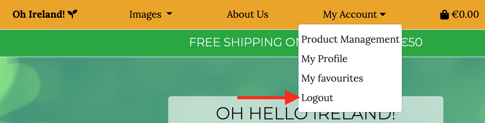
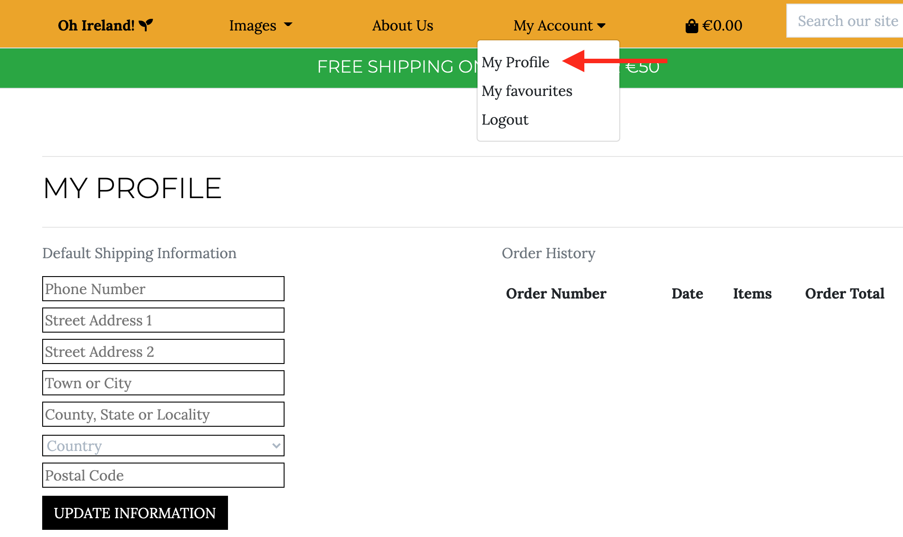

# TESTING.md

!NB: it is recommended to view the TESTING.md and README.md files in the GitHub Dark Theme turned on for distinct demarcation of the files' sections and screenshots. The Dark Theme can be turned on by going into your GitHub settings from the dropdown in the top right and then navigating to Appearance in the Account Settings from the menu on the left. Go to Theme Mode and select Single Theme (instead of the Sync with system) and then select a Dark Theme; refresh the page.

# CONTENT QUICK LINKS
## [User Stories](#user-stories-testing)
## [Validation](#code-validation)
## [Manual Tests](#manual-testing)
## [Automated Tests](#automated-testing)
## [Authenticaton](#user-authentication)
## [Forms](#form-validation)
## [Shopping Bag and Checkout](#shopping-bag-and-checkout)
## [Email](#emails)
## [Modals](#modal-testing)
## [CRUD](#crud-testing)
## [Bugs](#bugs-and-fixes)
## [RETURN TO README](https://github.com/olga-od-ua/hello_ireland/blob/main/README.md)

## User stories testing

### Viewing and Navigation

1. As a Customer I want to be able to see the full list of all products in order to select single products to purchase.

- This can be achieved from the Home page by clicking on "GO TO IMAGES BUTTON", the castle image or by following the All Images link in the main menu. Back to All products button and other buttons returning the customer to the Products page are also extensively available across the website.

2. As a Customer I want to be able to view individual product details so that I can see the image in a higher resolution by opening it in a new window, identify the price, product rating, description, available sizes.

- This is achieved by either clicking on the image itself or by clicking on the DETAILS button.

3. As a Customer I want to be able to see the grand total of my order at any time so that I can decide whether to buy more products or remove some from the basket.

- This goal is achieved through the grand total that is displayed right next to the shopping basket icon on the navigation bar.

4. As a Site User I want to be able to find some information about the website.

- The User will see the About Us navigation bar link and will be able to navigate to the About Us page where they will be able to find the general information about the website, see its best reviews and the photographers whose images are for sale.

### Registration and User Accounts

5. As a Site User I want to be able to easily register for an account so that I can have a personal account and to be able to view my profile.

- This is achieved through the "Register" link in the navbar.

6. As a Site User I want to be able to easily login and logout so that I can access my personal information.

- Log in functionality is available in multiple views of the website with the main location being the navbar. Logout functionality is available from the navbar only.

7. As a Site User I want to be able to easily recover password so that I can get access to my account.

- This is achievable from the login view from any login link the user follows.

8. As a Site User I want to be able to receive an email confirmation after registering in order to verify that my account registration was successful.

- A confirmation email is sent upon successful registration and the user can confirm their email by following the link provided in the confirmation email.

9. As a Site User I want to be able to have a personalized user account so that I can view my personal order history, save my payment details.

- This is also achievable after successful registration and the profile can be accessed by a user through My Profile navbar link.

### Sorting and Searching

10. As a Shopper I want to be able to sort the list of available products in order to identify the best-priced, alphabetically and categorically sorted products.

- The user is able to sort products alphabetically, by category and by price (low to high and high to low) within All products.

11. As a Shopper I want to be able to sort a specific category of products in order to identify the best-priced product in a selected category, sort products in that category by name.

- The user is able to sort products alphabetically, by category and by price (low to high and high to low) within a specific category of products.

12. As a Shopper I want to be able to search for a product by name, location or description	in order to find a specific product I'd like to purchase.

- The user can use a search bar from the navigation menu in order to perform such a search.

13. As a Shopper I want to be able to see what I've searched for in the search result and the number of my search results in order to quickly decide whether the product I need is available.

- This is also achievable through the search bar from the navbar and the results of an example search can be found in the User story number 13.

### Purchasing and Checkout

14. As a Shopper I want to be able to easily select the quantity of the products I want to purchase	so that I can add the correct product and its quantity to my shopping bag.

- A User can select the quantity of the desired product from the product details page.

15. As a Shopper I want to be able to view items in my shopping bag	so that I can identify the total cost of my order and the items I have ordered.

- All this information can be found in the User's shopping bag which is reachable from the navbar as well as from the "Go to secure checkout" button from the messages.

16. As a Shopper I want to be able to adjust the quantity of a particular item in my shopping bag so that I can easily make changes to my order before checkout.

- Users can adjust the quantity of a particular size of a particular item with the help of the quantity input field and the Update and Remove buttons.

17. As a Shopper I want to be able to easily submit my payment details in order to checkout effectively.

- This is achievable through the "Secure checkout" button. The user will be redirected to the Shipping information form and the credit card input.

18. As a Shopper I want to be assured that my personal and payment information is safe and secure so that I can confidently provide information that is needed to complete a purchase.

- This is achieved by providing clear instructions to the User to fill out the checkout form and input the card details as well as providing a very detailed summary of the changes.

19. As a Shopper I want to be able to view an order confirmation after checkout	so that I can verify that the order is correct.

- The User will see an order confirmation summary upon successful checkout.

20. As a Shopper I want to be able to receive an email confirmation after checkout in order to have a copy of the order confirmation for my records.

- Such email is received upon successful checkout. Please see the screenshot below.

### Admin and Store Management

21. As a Store Owner I want to be able to add a new product so that I can add new items to my shop.

- This is achievable through the Add product form from the Product Management link on the navbar.

22. As a Store Owner I want to be able to edit a product so that I can change product criteria such as price, description, image etc.

- This is possible by clicking on the "Edit" buttons on either the Products view or the Product Details view.

23. As a Store Owner I want to be able to delete a product so that I can remove items that are no longer on sale.

- This is possible by clicking on the "Delete" buttons on either the Products view or the Product Details view. Same screenshots as in User Story number 22 apply.

### Reviews and Ratings

24. As a Site User I want to be able to see reviews of products from other users in order to quickly decide whether this particular image is worth the purchase.

- Reviews are displayed on each product details page.

25. As a Site User I want to be able to leave a review or several reviews on a specific product in order to quickly and easily share my opinion and impression of the given product.

- An authenticated user can leave a review by clicking on the "Add a Review" button which will redirect the User to the Review form.

26. As a Site User I want to be able to delete my own review/reviews I have ever left on the website so that I can easily delete the information I personally shared about a specific product.

- An authenticated User will be able to delete their reviews by clicking on the red "Delete Your Review" button. See screenshot for User Story number 24.

### Favourite Products

27. As a Shopper/Site User I want to be able to add images that I liked to my favourites in order to quickly and easily find them in the future (e.g. save an image for a later purchase or review).

- An authenticated User will be able to add images that are for sale to the list of their favourite images by clicking on the "Add to favourites" button from the Product Details view. Once the image is in their Favourites, the button switches to the "Remove from favourites" button.

28. As a Shopper/Site User I want to be able to view images that I marked as my favourites so that I can proceed to purchase them.

- An authenticated User will be able to see their Favourite images in My Favourites section via the relevant navbar link.

29. As a Shopper/Site User I want to be able to remove images that I no longer want to be marked as My Favourites so that I can easily manage My Favourites section of my account.

- An authenticated User will be able to remove images from the list of their Favourite images from the My Favourites section or from the relevant Product Details view by clicking on the "Remove from favourites" buttons. These buttons can be seen on screenshots for User Stories number 27 and 28.

## **[BACK TO TOP](#content-quick-links)** *

## Code Validation

### **Html**:

HTML code of the website passed the validation without major errors or warnings. The "Bad value https://fonts.googleapis.com/css?family=Lora:400,700|Montserrat:300 for attribute href on element link: Illegal character in query: | is not allowed." error cannot be fixed as it is a required format by Google Fonts.

The "The type attribute is unnecessary for JavaScript resources." warning was left unchanged as it is has a vital role in the code. 

The error "Element li not allowed as child of element nav in this context" which was fixed by wrapping each list element of the mobile-top-header.html in an unordered list element.

### **CSS**:

All the CSS code passed the validation as shown on the screenshot above.

During the code review it was noticed that the css code for the styling of the checkout form fields was located in the project-level base.css file. It was moved to checkout.css.

### **PEP8 Compliance**:

All code was checked for valid indentation, whitespace, blank line space and line length using 
the [PEP8 validator](http://pep8online.com/).

Some flake8 and pylint errors were left unresolved due to the complexity of the indentation and readability of the code it would have created. For example, in the following code snippet the last line is marked as "too long" however it was decided to leave it unchanged to match the style of the two lines of code above it. For example, in the following code snippet the last line is marked as "too long" however it was decided to leave it unchanged to match the style of the two lines of code above it.

### **Javascript Validation**:

All Javascript code was validated using [Jshint validator](https://jshint.com/). All JavaScript code passed the validation without any major warnings or errors. A few missing semicolons were added and a few unnecessary ones were removed.

### Lighthouse performance test:

Lighthouse in Chrome devtools was used to test the website's performance. Following the Lighthouse recommendation, the report was generated from the Incognito mode.

Two warnings were taken into account and fixed, namely: 
- adding a meta description to base.html
- adding the rel="noopener" attribute to the external social media links located in the footer.

### Accessibility:

## **[BACK TO TOP](#content-quick-links)** *

## Manual Testing

### Responsive Design

The responsiveness of the website was being tested and gradually improved during the development process. There still may be a few styling issues for unpopular screen sizes.

### Call to action buttons

All call to action buttons were tested on multiple devices and no issues were found.

### External links

The only external links are the links to social networks in the footer and the urls for images full-screen view. These were all tested with no issues detected. All links open in a new window tab.

### Internal links

All the internal links have been rechecked multiple times on various devices to ensure their correct functionality.

It was also tested to see if a user will be able to carry out tasks they are not authorised for.

The following links are only available to logged-in users and if a user manually inputs one of the following liks the site throws an error:
- `https://hello-ireland.herokuapp.com/favourites/my_favourites`
- `https://hello-ireland.herokuapp.com/add/<int:product_id>` (add to favourites)
- `https://hello-ireland.herokuapp.com/remove/<int:product_id> `(remove from favourites)
- `https://hello-ireland.herokuapp.com/products/<int:product_id>/add_review/`
- `https://hello-ireland.herokuapp.com/products/<int:product_id>/delete_review/`
- `https://hello-ireland.herokuapp.com/profile/`

The following links are only available to the admin and when manually added by a user who is not an admin the Error message is displayed and the user is redirected to the Home Page:
- `https://hello-ireland.herokuapp.com/products/add/`
- `https://hello-ireland.herokuapp.com/products/edit/<int:product_id>/`
- `https://hello-ireland.herokuapp.com/products/delete/<int:product_id>`

## **[BACK TO TOP](#content-quick-links)** *

### User Authentication

User registration, sign in and sign out was thoroughly tested on multiple users and is working as expected which can also be seen from [User Stories Testing section](#user-stories-testing) with screenshots included.

### Adding Reviews and Adding to Favourites

Adding and deleting reviews is working as expected. Adding and removing to and from Favourites is also functioning as planned. Relevant screenshots can be found in [User Stories Testing section](#user-stories-testing).

## **[BACK TO TOP](#content-quick-links)** *

### Form Validation

All forms, their required fields and other forms of validation are functioning properly.

Review message textarea is currently restricted to 200 characters in order to avoid lengthy messages for UI purposes. This was chosen as a temporary "easy fix" due to time constraints in lieu of creating a "see more" button.

## **[BACK TO TOP](#content-quick-links)** *

### Shopping Bag and Checkout

All shopping bag and checkout functionality was thoroughly tested on various devices by multiple users and no errors were detected while trying to make a purchase or cancel the process at any time before successful payment. Relevant screenshots can be found in [User Stories Testing section](#user-stories-testing).

Stripe webhook events were also tested before project submission. All events were successful.

## **[BACK TO TOP](#content-quick-links)** *

## Automated Testing

## **[BACK TO TOP](#content-quick-links)** *

## CRUD Testing

1. For the testing purposes a product without an image was added to the database. It displayed the noimage.png as expected.  

2. A product without frame sizes was added for testing purposes of the size selector box. As expected, this product did not have the size selector box displayed in the product details view.

3. The Admin can add, edit and delete products. Al the Add Product form fields are working as expected, the fields marked as required must be filled out.

Other CRUD tests can also be traced in [User Stories Testing section](#user-stories-testing).

## **[BACK TO TOP](#content-quick-links)** *

## Bugs and fixes:

### Fixed bugs

* During the testing of the Delete Product function the following error was encountered while trying to delete a product that was still in the shopping bag: "No Product matches the given query." The following Slack post helped to resolve the issue: https://code-institute-room.slack.com/archives/C7HS3U3AP/p1631708528269000 by clearing the site data in the Application Storage.

* In the Shopping_bag view the add_to_bag view was throwing the following error: "class "Product" has no "objects" member" and the functionality was not working. 

Code suggested by the Boutique Ado walkthrough project:

`product = Product.objects.get(pk=item_id)`

The issue was eradicated with importing get_object_or_404 and refactoring the code in the following way: `product = get_object_or_404(Product, pk=item_id)`

* There was a bug on the OrdeLineItem model in the Products app which was displaying the following error when attempting to checkout: "OperationalError at /checkout/
table checkout_orderlineitem has no column named product_size". With the help from Sheryl in Tutor Support we fixed this error by specifying the name of the db_column:
`product_size = models.CharField(max_length=4, null=True, blank=True, db_column="product_size")`
and rerunning the migrations.

* At some point handle_payment_intent_succeeded data wasn't being printed to the terminal `print(intent)` which was fixed by re-exporting the `STRIPE_WH_SECRET=whsec_1BL1Fp0suM9QOI8qiu6OHAC6YhfJCm4c` (the signing secret).

* After completing the adding and deleting reviews functionality I accidentally submitted a review without a rating without realizing it. Further, I started getting the following error: "TypeError: int() argument must be a string, a bytes-like object or a number, not 'NoneType'". This lead to making the rating form field a required one.

* At some point there was an unexpected error in the deployed website. The error appeared when trying to open the Products or My Favourites pages. The errors displayed the following messages: ""ProgrammingError at /products/
column products_productreview.user_name_id does not exist
LINE 1: ...iew"".""id"", ""products_productreview"".""product_id"", ""products_..."" and ""ProgrammingError at /favourites/my_favourites/
relation ""favourites_favouriteproductslist"" does not exist
LINE 1: ...""favourites_favouriteproductslist"".""user_id"" FROM ""favourite..."" respectively."

This error was tackled by redeploying the website.
This also involved creating a new endpoint in stripe.

* The shipping cost was displayed with three decimal places in the confirmation email causing the grand total to be displayed in the same manner even though the Order model class specifies two decimal places for the shipping_cost field: `shipping_cost = models.DecimalField(max_digits=6, decimal_places=2, null=False, default=0)`. This bug was fixed by adding a floatformat filter to the confirmation email body.

* Upon completion of the shopping bag functionality with thoroughly followed steps described in the Boutique ADO walkthrough project, it was still possible for a user to manually input quantity outside 1-99 range and successfully update the shopping bag with that input. It appeared that min="1" and max="99" attributes were not working with the implemented quantity input JavaScript code. The solution was to restrict the manual input of values outside 1-99 range by using a jQuery solution offered by Praveen Kumar Purushothaman on [Stackoveflow](https://stackoverflow.com/questions/32936352/html-number-input-min-and-max-not-working-properly#:~:text=you%20can%20only-,restrict,-the%20values%20to).

The "+" and "-" increment and decrement buttons still have some flaws, e.g. if the current input value is 98 (meaning that both increment and decrement "+" and "-" buttons are not disabled, we can then manually change the quantity value to 99 and if we then press the increment "+" button, the quantity will change to 100 and the increment button gets disabled. The same happens if the current quantity value is 2, then we manually change it to 1 which does not disable the decrement "-" button, then click on the decrement "-" button and the value turns into 0 therefore the product gets removed from the shopping bag if the user proceeds to update this product. It was decided to leave this issue for the time being as it does not drastically affect the business logic (a customer cannot go over 100 items and the case of a customer performing the steps described above are expected to be extremely rare).

* `git push heroku master` displays the following errors:
`error: src refspec master does not match any`
`error: failed to push some refs to 'https://git.heroku.com/oh-hello-ireland.git'`
I used the following command instead: "git push heroku main" whenever I needed to push to Heroku.

### Known Bugs

* It is known that there are still some minor responsive styling issues for unpopular screen sizes that are planned to be tackled in the future.

* Currently when a user signs in from a product details page from the login link under the review section, they are brought to the sign in page and once logged in, they are redirected to the home page instead of the same product details page. Due to time constraints, this issue was not resolved and is planned to be tackled in the future.

* Orders in a User's order history are sometimes not being sorted by date in the deployed app, however are sorted by date in the development mode.

* Input fields in focus are left unstyled for both visual and time-saving purposes.

* Back to all products button appears even when there is no category selected, no search or sorting was performed.

* There is a number of flake8 and pylint errors that were not resolved due to my lack of experience and knowledge (which is constantly improving), as well as time constraints and the complexity and potential affect on the functionality of the site.

* Rating field is still displayed and is editable in the Add Product form. Since the ratings are coming from user reviews, this field should not be editable by anyone (including the site admin). This will be taken care of in the future as the time did not allow to look into this issue closely.

* The toasts messages reappear from the previous action when the back browser button is clicked. It is planned in the future to implement a timeout function and ensure the message does not reappear.

### Not bugs but the room for improvement and other notes.

* It is planned to prepopulate the user's full name in the checkout form for authenticated users.

* Blue outline can be traced throughout the website upon a click on a button or link. This was not tackled due to time constraints.

* There is no way to run out of images so the database was not designed to have a certain amount of stock.

* There is currently no pagination or back to top button in place on My Favourites page and this is planned as a future feature.

* Currently all the products are images hence they have frame sizes. The functionality for products with no frame sizes was implemented for educational purposes and in case the store will start selling products with no frame sizes, e.g. digital images only.

* As this project is for educational purposes the watermarks have not been removed.

* If only one product is displayed after running a search query, the sorting dropdown is not disabled.

* On the About Us page only 5-star reviews were selected. This was done for business advertising purposes.

## **[BACK TO TOP](#content-quick-links)** *

